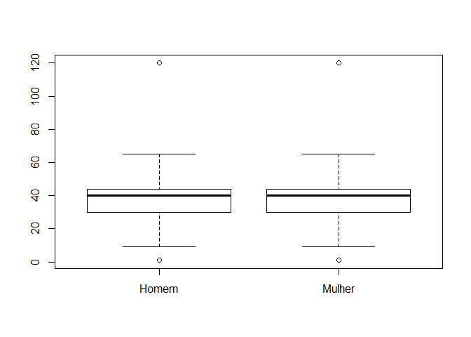
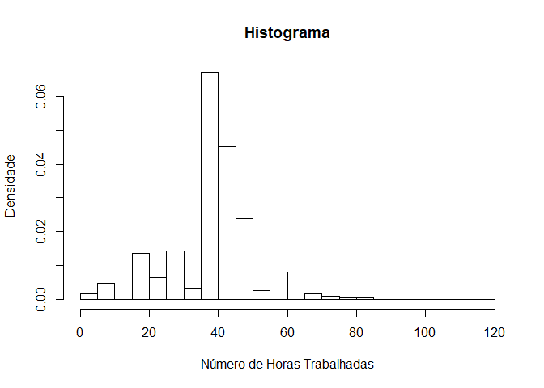
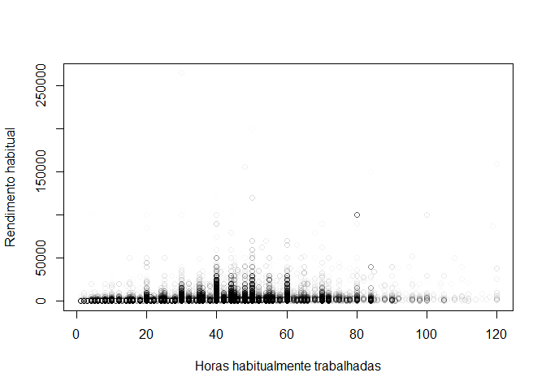
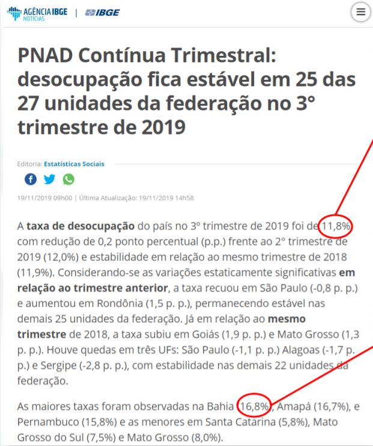

Analisando Dados da PNAD Contínua
================
Fillipe Guedes
18/04/2021

# Preparando o R

``` r
memory.limit(size=20000) #  Definindo limite de memoria para compilacao do programa
```

    ## [1] 20000

``` r
options(encoding="latin1") # Definindo opcao de codificacao dos caracteres e linguagem
options(scipen=999)#Definindo opcao de exibicao de numeros sem exponencial
```

# PNAD Contínua

## Baixando os dados principais

Carregando o pacote

``` r
library("PNADcIBGE")
```

Gerando microdados da PNAD Continua pelo metodo automatico. Vamos baixar
dados do terceiro trimestre de 2018

``` r
variaveis_selecionadas <- c("V2007", "V2009", "V2010", "VD3004", "VD4019", "VD4031", "V1028")
dadosPNADc <- get_pnadc(year=2018, quarter=3, labels=TRUE, deflator=TRUE, design=FALSE, vars=variaveis_selecionadas)
```

Dado o número de linhas, a PNADc entrevistou 559.761 pessoas.

## Encontrando Estatísticas Básicas (estimativas populacionais)

Obtendo total e media da renda mensal habitual para a amostra da base de
coleta

``` r
sum(x=dadosPNADc$VD4019, na.rm=TRUE)
```

    ## [1] 448739758

``` r
mean(x=dadosPNADc$VD4019, na.rm=TRUE)
```

    ## [1] 1974.522

Entretanto, é desta maneira que devemos calcular estimativas de
pesquisas amostrais complexas. Como nem todos respondem às mesmas
perguntas do questionário, temos informações NA nos dados e, por isso,
devemos trabalhar com o argumento na.rm=TRUE para remover os NAs.

Devemos, então, aplicar o desenho amostral nos microdados

``` r
dadosPNADc <- pnadc_design(data_pnadc=dadosPNADc)
```

Agora, temos uma estrutura de dados amostrais complexo

``` r
class(dadosPNADc)
```

    ## [1] "survey.design2" "survey.design"

O desenho amostral também pode ser criado manualmente. Para especificar
o desenho da amostra, é necessário identificar a unidade primária de
amostragem (UPA) no argumento ids, o estrato no argumento strata, e os
pesos dos domicílios no argumento weights. Essas variáveis podem ser
obtidas no dicionário. Note que existem dois pesos, o V1027 e o V1028. O
segundo é o peso pós-estratificação, que é o que utilizaremos. Se você
utilizar o primeiro peso, deve realizar a estratificação manualmente
através do comando postStratify.

``` r
library(tidyverse)
library(srvyr)
```

``` r
pnad_design <- dadosPNADc %>%
     as_survey_design(
         ids = UPA,
         strata = Estrato,
         weights = V1028,
         nest = TRUE
     )
```

A vantagem de usar o passo acima é que podemos usar a sintaxe do pacote
dplyr em dados amostrais complexos.

Para estimativas de estruturas de dados amostrais complexas para a base
de dados gerada a partir do comando pnadc_design, precisamos carregar o
pacote survey. Para o caso manual acima, trabalhamos com o pacote srvyr

``` r
library("survey")
library(srvyr) 
```

Estimando total da renda mensal habitual

``` r
totalrenda <- svytotal(x=~VD4019, design=dadosPNADc, na.rm=TRUE)
totalrenda
```

    ##               total         SE
    ## VD4019 200264857640 2908780215

No caso manual, temos

``` r
pnad_design %>%
     summarise(Total = survey_total(x = VD4019, vartype = "ci", na.rm=T))
```

    ##          Total    Total_low    Total_upp
    ## 1 200264857640 194563277906 205966437375

Vemos, assim, que há uma expressiva diferença em relação a renda total
calculada anteriormente. Portanto, quando estamos trabalhando com
pesquisas domiciliares precisamos necessariamente inserir o desenho
amostral para calcular estimativas populacionais.

Exibindo coeficiente de variacao e intervalo de confianca para o caso
automático

``` r
cv(totalrenda)
```

    ##            VD4019
    ## VD4019 0.01452467

``` r
confint(totalrenda)
```

    ##               2.5 %       97.5 %
    ## VD4019 194563753180 205965962101

Podemos também trabalhar com mais de uma variável. Estimando o total de
pessoas por sexo e cor.

``` r
totalsexoraca <- svytotal(x=~V2007 + V2010, design=dadosPNADc, na.rm=TRUE)
totalsexoraca
```

    ##                     total        SE
    ## V2007Homem    100438773.3 145301.45
    ## V2007Mulher   107621854.7 145301.45
    ## V2010Branca    90087231.5 419830.31
    ## V2010Preta     18217552.1 205318.36
    ## V2010Amarela    1467773.1  72355.84
    ## V2010Parda     97545073.3 392001.04
    ## V2010Indígena    740537.7  37571.75
    ## V2010Ignorado      2460.3    869.86

``` r
# Para o caso manual, 

pnad_design %>%
    group_by(V2007) %>%
    summarise(Total = survey_total( na.rm = T, vartype = "ci"))
```

    ## # A tibble: 2 x 4
    ##   V2007       Total  Total_low  Total_upp
    ##   <fct>       <dbl>      <dbl>      <dbl>
    ## 1 Homem  100438773. 100153964. 100723583.
    ## 2 Mulher 107621855. 107337045. 107906664.

``` r
pnad_design %>%
    group_by(V2010) %>%
    summarise(Total = survey_total( na.rm = T, vartype = "ci"))
```

    ## # A tibble: 6 x 4
    ##   V2010        Total Total_low Total_upp
    ##   <fct>        <dbl>     <dbl>     <dbl>
    ## 1 Branca   90087231. 89264311. 90910152.
    ## 2 Preta    18217552. 17815102. 18620002.
    ## 3 Amarela   1467773.  1325946.  1609600.
    ## 4 Parda    97545073. 96776701. 98313445.
    ## 5 Indígena   740538.   666892.   814183.
    ## 6 Ignorado     2460.      755.     4165.

Portanto, na pesquisa em questão estima-se que tinhamos 100.438.773
homens na população e 107.621.854 mulheres. Adicionalmente, 90.087.231
pessoas brancas. O mesmo raciocínio se aplica às demais variáveis.

Para verificarmos interseção entre as variáveis sexo e cor, usamos a
seguinte função

``` r
totalsexoraca_interacao <- svytotal(~interaction(V2007, V2010), design=dadosPNADc, na.rm=TRUE)
totalsexoraca_interacao
```

    ##                                                total        SE
    ## interaction(V2007, V2010)Homem.Branca    42538167.59 224012.76
    ## interaction(V2007, V2010)Mulher.Branca   47549063.90 249093.37
    ## interaction(V2007, V2010)Homem.Preta      8995156.76 108320.85
    ## interaction(V2007, V2010)Mulher.Preta     9222395.34 119664.53
    ## interaction(V2007, V2010)Homem.Amarela     689459.44  37426.73
    ## interaction(V2007, V2010)Mulher.Amarela    778313.67  41655.21
    ## interaction(V2007, V2010)Homem.Parda     47870923.56 216652.58
    ## interaction(V2007, V2010)Mulher.Parda    49674149.75 226821.81
    ## interaction(V2007, V2010)Homem.Indígena    343202.15  19625.94
    ## interaction(V2007, V2010)Mulher.Indígena   397335.50  22602.44
    ## interaction(V2007, V2010)Homem.Ignorado      1863.83    753.83
    ## interaction(V2007, V2010)Mulher.Ignorado      596.51    434.06

``` r
# Para o outro caso

pnad_design %>%
    group_by(V2007, V2010) %>%
    summarise(Total = survey_total(vartype = "ci"))
```

    ## # A tibble: 12 x 5
    ## # Groups:   V2007 [2]
    ##    V2007  V2010        Total Total_low Total_upp
    ##    <fct>  <fct>        <dbl>     <dbl>     <dbl>
    ##  1 Homem  Branca   42538168. 42099074. 42977261.
    ##  2 Homem  Preta     8995157.  8782834.  9207479.
    ##  3 Homem  Amarela    689459.   616098.   762821.
    ##  4 Homem  Parda    47870924. 47446257. 48295590.
    ##  5 Homem  Indígena   343202.   304733.   381671.
    ##  6 Homem  Ignorado     1864.      386.     3341.
    ##  7 Mulher Branca   47549064. 47060809. 48037319.
    ##  8 Mulher Preta     9222395.  8987838.  9456953.
    ##  9 Mulher Amarela    778314.   696664.   859963.
    ## 10 Mulher Parda    49674150. 49229550. 50118749.
    ## 11 Mulher Indígena   397336.   353032.   441639.
    ## 12 Mulher Ignorado      597.     -254.     1447.

Existem duas formas de se obter médias em pesquisas amostrais complexas,
as médias de variáveis contínuas e médias de variáveis categórica. Vamos
trabalhar com o primeiro caso agora, então, estimando media da renda
mensal habitual temos:

``` r
mediarenda <- svymean(x=~VD4019, design=dadosPNADc, na.rm=TRUE)
mediarenda
```

    ##          mean     SE
    ## VD4019 2224.1 30.636

``` r
pnad_design %>%
    summarise(Total = survey_mean(x=VD4019, na.rm = T, vartype = "ci"))
```

    ##      Total Total_low Total_upp
    ## 1 2224.092  2164.042  2284.142

A média da renda mensal habitual é de 2224 reais, que é bem diferente da
obtida anteriormente.

Para médias de variáveis categóricas, devemos estimar a proporção.
Estimando proporcao de sexo

``` r
propsexo <- svymean(x=~V2007, design=dadosPNADc, na.rm=TRUE)
propsexo
```

    ##                mean     SE
    ## V2007Homem  0.48274 0.0007
    ## V2007Mulher 0.51726 0.0007

``` r
pnad_design %>%
    group_by(V2007) %>%
    summarise(Total = survey_prop(na.rm = T, vartype = "ci"))
```

    ## # A tibble: 2 x 4
    ##   V2007  Total Total_low Total_upp
    ##   <fct>  <dbl>     <dbl>     <dbl>
    ## 1 Homem  0.483     0.481     0.484
    ## 2 Mulher 0.517     0.516     0.519

Estimando a mediana (quantil 0.5) e quantis (1o quantil = 0,25 e 3o
quantil igual a 0,75) da renda mensal habitual. Adicionalmente, vamos
perdir os percentis 90, 95 e 98.

``` r
medianarenda <- svyquantile(x=~VD4019, design=dadosPNADc, quantiles=c(0.25, 0.5, 0.75, 0.9, 0.95, 0.98), na.rm=TRUE)
medianarenda
```

    ## $VD4019
    ##      quantile ci.2.5 ci.97.5          se
    ## 0.25      954    954     957   0.7652564
    ## 0.5      1300   1300    1400  25.5085457
    ## 0.75     2200   2200    2300  25.5085457
    ## 0.9      4200   4000    4500 127.5427287
    ## 0.95     7000   7000    8000 255.0854573
    ## 0.98    11400  10000   12000 510.1709147
    ## 
    ## attr(,"hasci")
    ## [1] TRUE
    ## attr(,"class")
    ## [1] "newsvyquantile"

``` r
pnad_design %>%
    summarise(Total = survey_quantile(x = VD4019, quantiles = c(0.25, 0.5, 0.75, 0.9, 0.95, 0.98), na.rm = T, vartype = "ci"))
```

    ##   Total_q25 Total_q50 Total_q75 Total_q90 Total_q95 Total_q98 Total_q25_low
    ## 1       954      1300      2200      4200      7000     11400           954
    ##   Total_q50_low Total_q75_low Total_q90_low Total_q95_low Total_q98_low
    ## 1          1300          2100          4000          6200         10000
    ##   Total_q25_upp Total_q50_upp Total_q75_upp Total_q90_upp Total_q95_upp
    ## 1           954          1300          2300          4500          7000
    ##   Total_q98_upp
    ## 1         12000

Assim, vemos que no primeiro trimestre de 2018, metade da população
recebia até 1.300 reais e 95% da população recebia até 7000 reais

Podemos também fazer recortes dentro dos microdadas. Estimando a renda
media para mulheres acima de 30 anos

``` r
rendaM30 <- svymean(x=~VD4019, design=subset(dadosPNADc, V2007 == "Mulher" & V2009 > 30), na.rm=TRUE)
rendaM30
```

    ##          mean     SE
    ## VD4019 2120.7 41.799

``` r
pnad_design %>%
  filter(V2007 == 'Mulher' & V2009>30) %>%
    summarise(Total = survey_mean(x = VD4019, na.rm = T, vartype = "ci"))
```

    ##      Total Total_low Total_upp
    ## 1 2120.728  2038.796   2202.66

A renda para mulheres acima de 30 anos no Brasil é de 2120 reais.

Agora, vamos fazer uma estimativa usando o nível de uma outra variável.
Estimando a frequencia relativa de homens e mulheres em cada nivel de
instrucao

``` r
freqSexoInstr <- svyby(formula=~V2007, by=~VD3004, design=dadosPNADc, FUN=svymean, na.rm=TRUE, vartype=NULL)
print(freqSexoInstr, row.names=FALSE)
```

    ##                                    VD3004 V2007Homem V2007Mulher se.V2007Homem
    ##  Sem instrução e menos de 1 ano de estudo  0.4918917   0.5081083   0.003014737
    ##     Fundamental incompleto ou equivalente  0.5063527   0.4936473   0.001389698
    ##       Fundamental completo ou equivalente  0.5001980   0.4998020   0.003236836
    ##           Médio incompleto ou equivalente  0.5063699   0.4936301   0.003504877
    ##             Médio completo ou equivalente  0.4672928   0.5327072   0.001730225
    ##        Superior incompleto ou equivalente  0.4612567   0.5387433   0.004564638
    ##                         Superior completo  0.4053033   0.5946967   0.002461703
    ##  se.V2007Mulher
    ##     0.003014737
    ##     0.001389698
    ##     0.003236836
    ##     0.003504877
    ##     0.001730225
    ##     0.004564638
    ##     0.002461703

``` r
pnad_design %>%
     group_by(VD3004, V2007) %>%
     summarise(Total = survey_prop(na.rm = T, vartype = "ci"))
```

    ## # A tibble: 16 x 5
    ## # Groups:   VD3004 [8]
    ##    VD3004                                   V2007  Total Total_low Total_upp
    ##    <fct>                                    <fct>  <dbl>     <dbl>     <dbl>
    ##  1 Sem instrução e menos de 1 ano de estudo Homem  0.492     0.486     0.498
    ##  2 Sem instrução e menos de 1 ano de estudo Mulher 0.508     0.502     0.514
    ##  3 Fundamental incompleto ou equivalente    Homem  0.506     0.504     0.509
    ##  4 Fundamental incompleto ou equivalente    Mulher 0.494     0.491     0.496
    ##  5 Fundamental completo ou equivalente      Homem  0.500     0.494     0.507
    ##  6 Fundamental completo ou equivalente      Mulher 0.500     0.493     0.506
    ##  7 Médio incompleto ou equivalente          Homem  0.506     0.499     0.513
    ##  8 Médio incompleto ou equivalente          Mulher 0.494     0.487     0.501
    ##  9 Médio completo ou equivalente            Homem  0.467     0.464     0.471
    ## 10 Médio completo ou equivalente            Mulher 0.533     0.529     0.536
    ## 11 Superior incompleto ou equivalente       Homem  0.461     0.452     0.470
    ## 12 Superior incompleto ou equivalente       Mulher 0.539     0.530     0.548
    ## 13 Superior completo                        Homem  0.405     0.400     0.410
    ## 14 Superior completo                        Mulher 0.595     0.590     0.600
    ## 15 <NA>                                     Homem  0.507     0.500     0.514
    ## 16 <NA>                                     Mulher 0.493     0.486     0.500

para pessoas com o menor nível de instrução, 51% eram mulheres e 49%
eram homens.

## Gráficos Básicos

Esbocando boxplot do numero médio de horas trabalhadas por sexo

``` r
svyboxplot(formula=VD4031 ~ V2007, design=dadosPNADc)
```

<!-- -->

Esbocando histograma da distribuicao de frequencia do numero de horas
trabalhadas

``` r
svyhist(formula=~as.numeric(VD4031), design=dadosPNADc, main="Histograma", xlab="Número de Horas Trabalhadas", ylab="Densidade")
```

<!-- -->

Esbocando grafico de dispersao entre numero de horas trabalhadas e renda
mensal habitual

``` r
svyplot(formula=VD4019 ~ VD4031, design=dadosPNADc, style="transparent", xlab="Horas habitualmente trabalhadas", ylab="Rendimento habitual")
```

<!-- -->

## Testes Estatísticos

Assim, como gráficos, dentro do pacote survey também podemos realizar
testes estatísticos. Realizando teste t de student para verificar se
existe diferenca de rendimentos entre sexos

``` r
svyttest(formula=VD4019 ~ V2007, design=dadosPNADc)
```

    ## 
    ##  Design-based t-test
    ## 
    ## data:  VD4019 ~ V2007
    ## t = -23.79, df = 14515, p-value < 0.00000000000000022
    ## alternative hypothesis: true difference in mean is not equal to 0
    ## 95 percent confidence interval:
    ##  -592.3563 -502.1741
    ## sample estimates:
    ## difference in mean 
    ##          -547.2652

Assim, rejeitamos a hipótese nula de que a diferença entre as médias é
igual a 0. Ou seja, há diferenciais salariais.

## Taxa de Ocupação / Desocupação

Uma das informações mais importantes que é divulgada pela pesquisa PNAD
Contínua é a taxa de desemprego no Brasil. Vejamos abaixo a figura
recentemente publicada pelo IBGE.



Vamos ver como calcular esta estatística com os pacotes aqui
apresentados. Carregando dados do 3o trimestre de 2019

``` r
dadosPNADc_32019 <- get_pnadc(year=2019, quarter=3, labels=TRUE, deflator=TRUE, design=FALSE)

dadosPNADc_32019 <- dadosPNADc_32019 %>%
     as_survey_design(
         ids = UPA,
         strata = Estrato,
         weights = V1028,
         nest = TRUE
     )
```

Vejamos agora gerar a proporção de ocupados e desocupados

``` r
dadosPNADc_32019 %>%
    group_by(VD4002) %>%
    filter(!is.na(VD4002)) %>%
    summarise(Des = survey_prop(vartype = "ci", na.rm = T))
```

    ## Adding missing grouping variables: `VD4002`

    ## # A tibble: 2 x 4
    ##   VD4002                Des Des_low Des_upp
    ##   <fct>               <dbl>   <dbl>   <dbl>
    ## 1 Pessoas ocupadas    0.881   0.879   0.883
    ## 2 Pessoas desocupadas 0.119   0.117   0.121

Portanto, vimos que a proporção de desocupados é de 11,8% da população,
assim como exibido pela notícia.

Para verificar o total de pessoas ocupadas e desocupadas, fazemos

``` r
dadosPNADc_32019 %>%
    group_by(VD4002) %>%
    filter(!is.na(VD4002)) %>%
    summarise(Des = survey_total(vartype = "ci", na.rm = T))
```

    ## Adding missing grouping variables: `VD4002`

    ## # A tibble: 2 x 4
    ##   VD4002                    Des   Des_low   Des_upp
    ##   <fct>                   <dbl>     <dbl>     <dbl>
    ## 1 Pessoas ocupadas    94736611. 93636982. 95836241.
    ## 2 Pessoas desocupadas 12798317. 12518944. 13077690.

Assim, são 12,5 milhões de pessoas desocupadas no total

## Coletando Informações da PNADC diretamente da SIDRA (pacote sidrar)

Podemos também usar diretamente a fonte de informações da SIDRA para
coletar dados da PNADC. Para isto, devemos usar o pacote sidrar

``` r
library(sidrar)
```

Vamos refazer o exercício feito anteriormente, só que agora, vamos usar
os dados da PNADC coletados diretamente da base de dados da SIDRA. A
tabela que fornece a Taxa de Desocupação para a população Total é a
6397.

``` r
Tx_Desocupacao <- get_sidra(x = 6397,
                 variable = 4099, 
                 classific = c('C58'), 
                 category = list(95253),
                 geo = "Brazil",
                 period = '201903',
                 header = TRUE,
                 format = 1) %>%
  rename('Tx Desocupação' = Valor)

# Para consulta da classificação e do código, devemos clicar no botão de'Opções Avançadas' que fica no fim da página da tabela (https://sidra.ibge.gov.br/tabela/6397) 

Tx_Desocupacao$`Tx Desocupação`
```

    ## [1] 11.9

Portanto, chegamos ao mesmo valor através da consulta direta.

.

## Microdados Anuais

Existem também formas de carregar os dados do PNAD Contínua filtrando a
partir de outras informações. Carregando microdados anuais da PNAD
Continua da primeira visita de 2018

``` r
PNADcAnual_Visita <- get_pnadc(year=2018, interview=1, labels=TRUE, deflator=TRUE, design=TRUE, defyear=2019)
```

Se quisermos o microdado anual de 2018 para um tópico específico,
utilizamos

``` r
PNADcAnual_Trimestre <- get_pnadc(year=2018, topic=2, labels=TRUE, deflator=TRUE, design=TRUE, defyear=2019, defperiod=2)
```

No caso acima, temos temas que foram coletados apenas no segundo
trimestre de 2018

Trabalhar com Infomações sobre domicílio ao invés de informação por
habitante

``` r
svymean(x=~VD5008, design = subset(PNADcAnual_Visita, V2005 == 'Pessoa responsável pelo domicílio'), na.rm=TRUE)
```

    ##          mean    SE
    ## VD5008 1583.1 22.56

Vemos que a média de rendimentos por domicílio é 1583 reais. Portanto, a
estimativa a nível domiciliar DEVE SER FEITA DESTA MANEIRA, conforme
orientação do IBGE.

PARA MAIS INFORMAÇÕES SOBRE O PACOTE SURVEY, RODAR O CÓDIGO

``` r
help(survey)
```

    ## No documentation for 'survey' in specified packages and libraries:
    ## you could try '??survey'

# Referências

Blog do professor Regis Ely

Aula do professor Marconi Souza

Material online do Douglas Braga

Live do Gabriel Henrique
